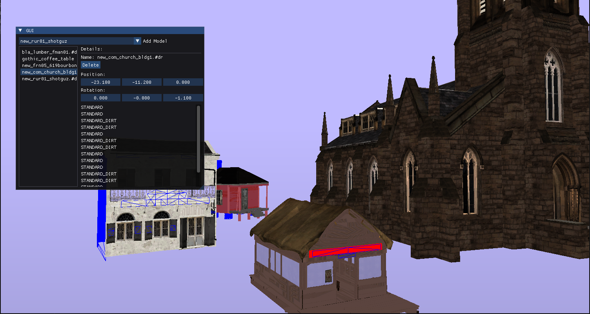
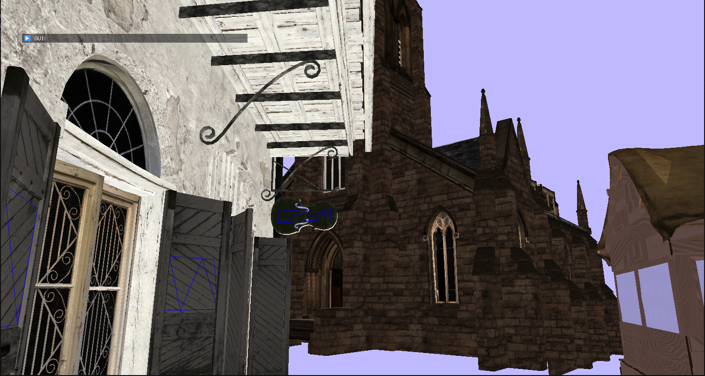
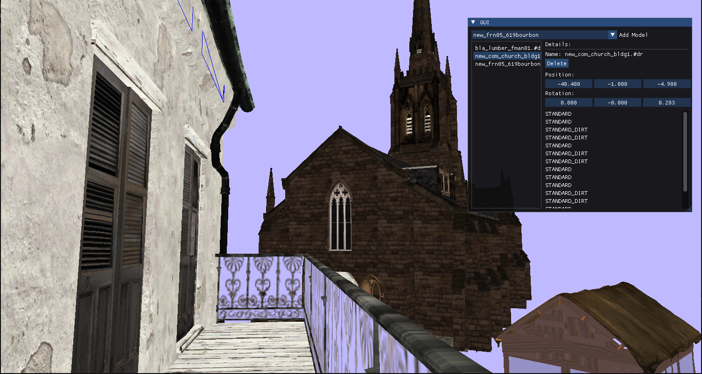

**A small Renderer for .ydr files from RDR2**
### Goal ###
this was a small uni project for gpu programming
I had a few goals for it:
- create a larger c++ project
- give reverse engineering of file formats a try
- learn more about the renderpipline of RDR2
- implement a deferred renderer

### Impressions ###

### Usage ###
This program only can parse decompressed and decrypted files, use CodeX from dexyfex for it. Or dump from memory.
1. put the .ydr file under resources>models
2. put the textures as .dds in resources>textures
3. and add the name in graphics>GUI.h (I forgot this cumbersome way)
4. `make`
5. run app\
**Controls:**\
WASD + QE + Mouse for movement\
Tab for menu\
Esc to close\

### Conclusion ###
It was a fun project but way to ambishous for the given timeframe.\
I spend more time reversing file formats than understanding and implementing the renderpipline and the light calculation.\
And there are way to many diffrent shaders to implement each.\
I learned so much during this project that now I would nearly redo everything again. Especially a better memory managment with RAII and smart pointers because I didn't fully grasp the concepts yet. Also I really like kaitai structs IDE for reversing, but the parser feels to generic. I also should have taken more time with the rendering, understand the diffrent color channels better and I really liked to implement shadow. So many little and large things I would make totally diffrent.\
As I also didn't do the whole .rpf file system with decryption and decompression, I wasn't able to get the offset for the embedded textures.

### Libaries ###
- SDL3
- GLEW
- glm
- gli
- kaitai struct
- OpenGL 3+
- S3TC
- ImGui

### Credits ###
[learnopengl.com](https://learnopengl.com/)\
[CodeX by dexyfex](https://discord.gg/codewalker)\
[Kaitai Struct](https://kaitai.io/)\
[OpenGL Mathematics](https://github.com/g-truc/glm)\
[OpenGL Image](https://github.com/g-truc/gli)\
[Poly Haven](https://polyhaven.com/)
